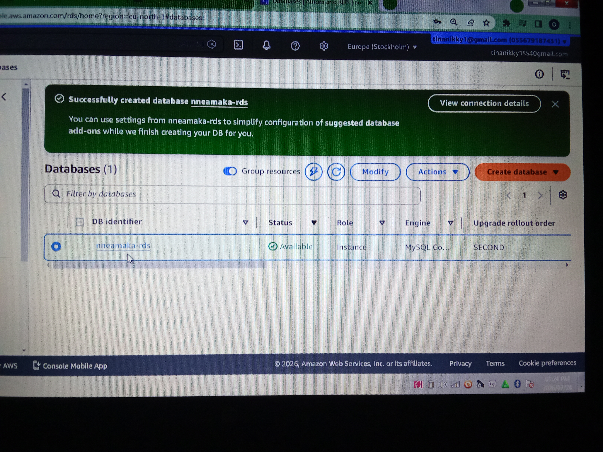
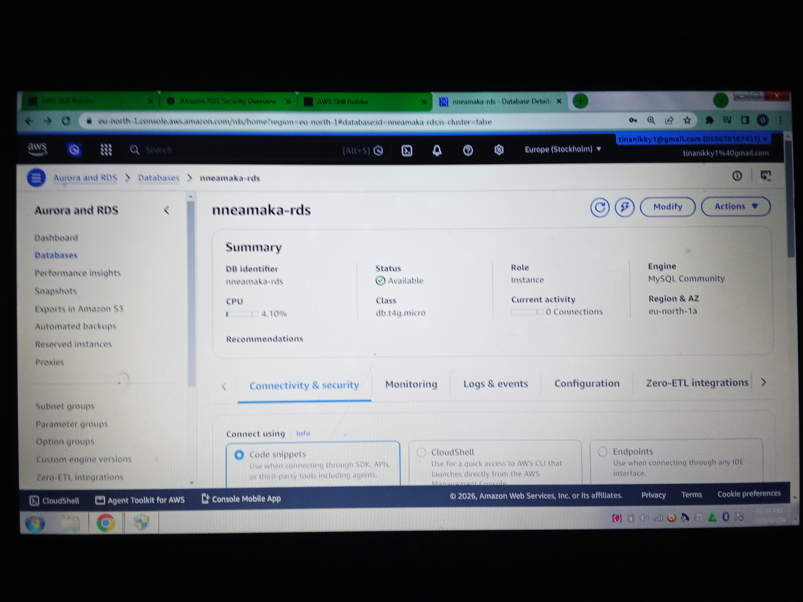
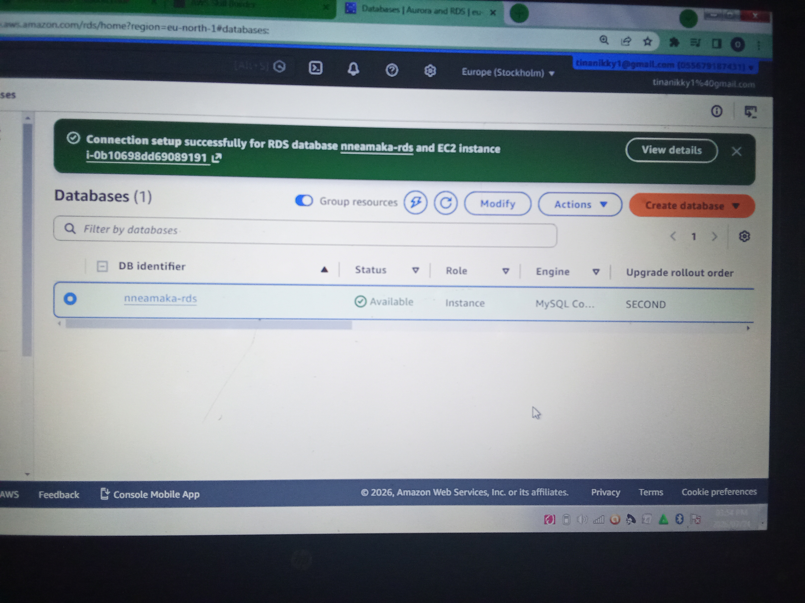

## Screenshots

### 1. MySQL Engine Selected
Selected MySQL Community Edition while creating the Amazon RDS database.

---

### 2. Successfully Created Amazon RDS Database
The Amazon RDS MySQL database instance was successfully provisioned.

---

### 3. Amazon RDS Dashboard
Viewing the database status, monitoring information, and connectivity options.

---

### 4. RDS Connected to EC2
Successfully configured connectivity between Amazon EC2 and Amazon RDS.

---

### 5. Basic SQL Commands
Example SQL commands used to create a database and related tables after connecting to the MySQL instance.

> **Note:** The SQL statements shown in this project are based on the AWS Skill Builder demonstration. The lab focused on provisioning and configuring an Amazon RDS MySQL instance rather than installing a local SQL client and executing the queries.
