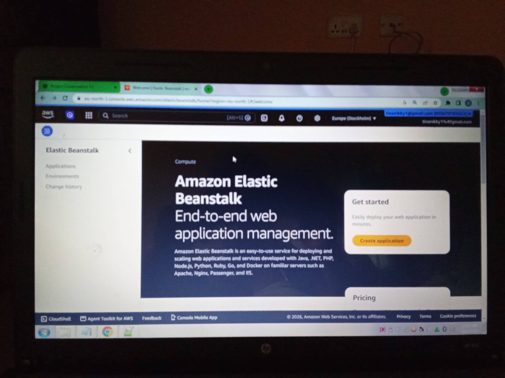
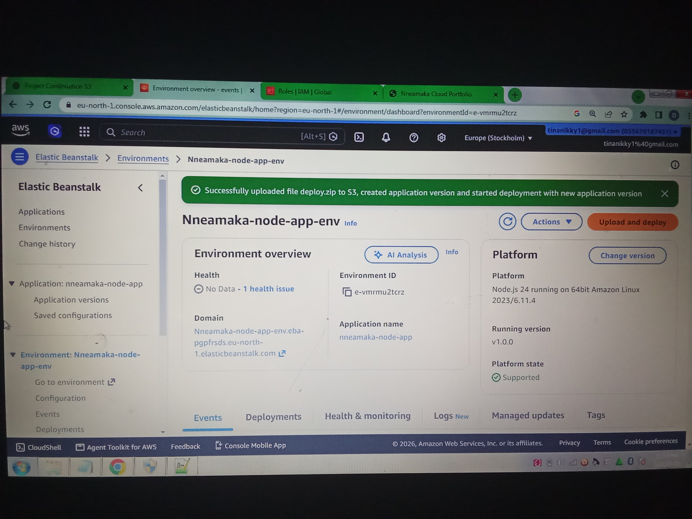
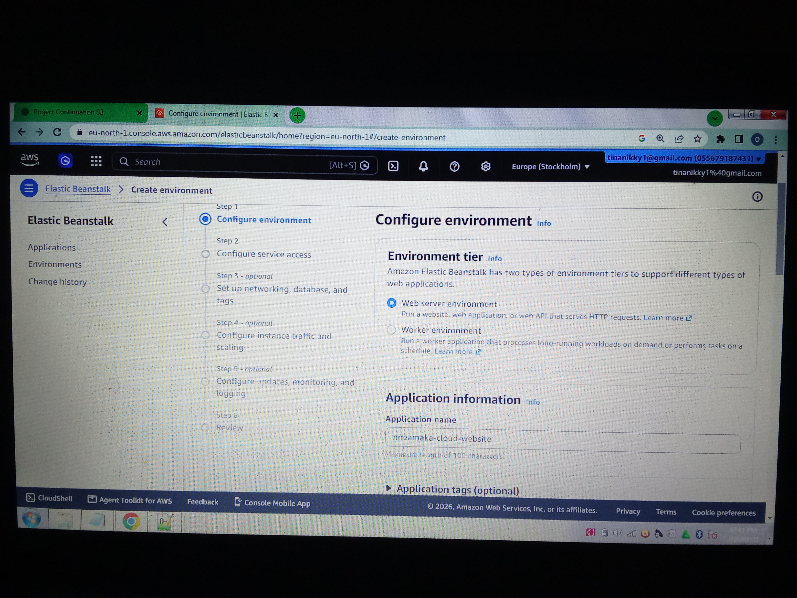
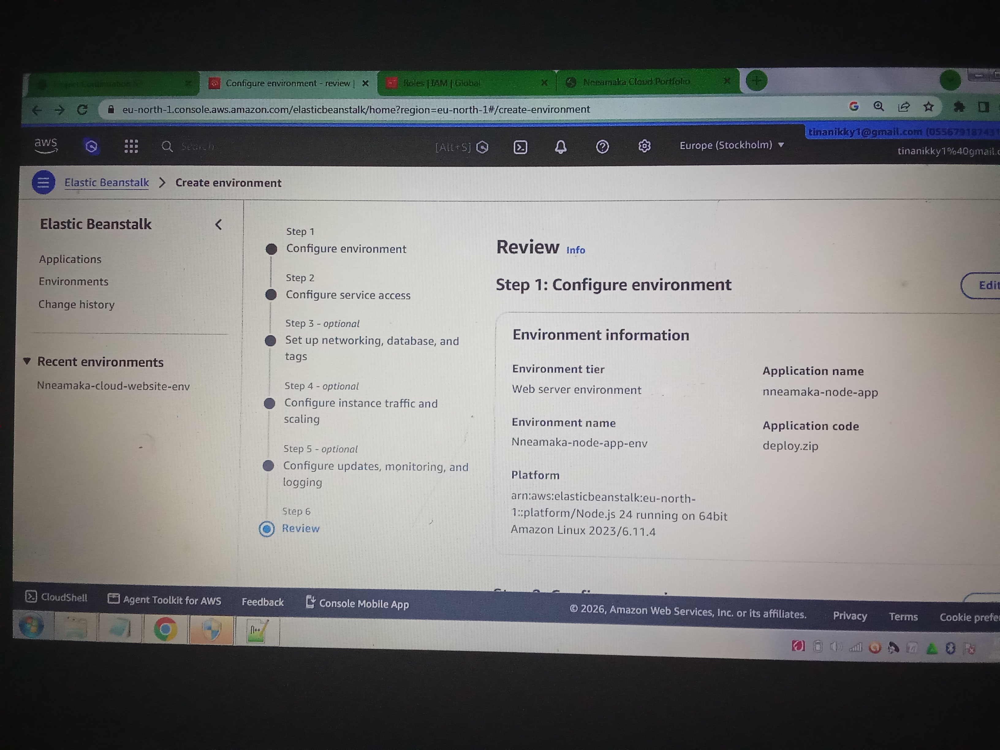
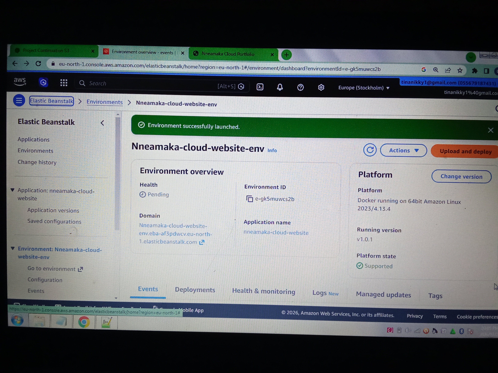
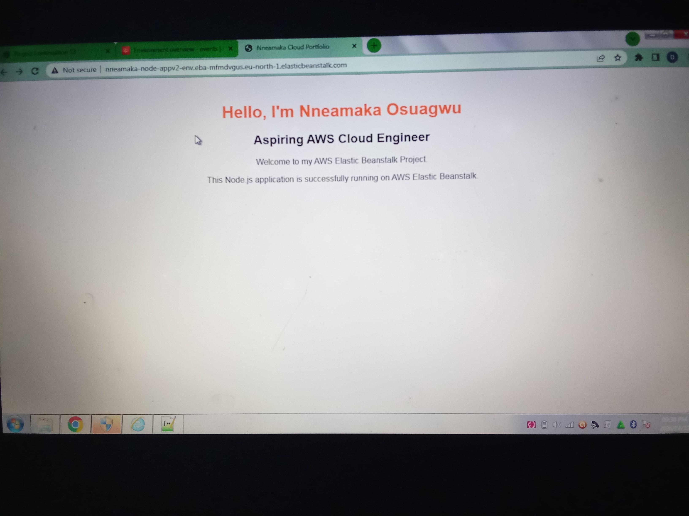

# Project 3: Deploying a Node.js Application on AWS Elastic Beanstalk

## Project Overview

This project demonstrates how to deploy a Node.js web application on AWS Elastic Beanstalk.

The objective was to learn how Elastic Beanstalk simplifies application deployment by automatically provisioning infrastructure, deploying application code, monitoring the environment, and managing the application lifecycle.

## AWS Services Used

- AWS Elastic Beanstalk
- Amazon EC2
- AWS Identity and Access Management (IAM)

## Project Objectives

- Create a Node.js web application.
- Package the application for deployment.
- Configure Elastic Beanstalk.
- Deploy the application to AWS.
- Verify that the application is accessible through a public URL.

## Project Files

The application contains the following files:

- `server.js`
- `package.json`
- `Procfile`

## Deployment Steps

1. Created a new Elastic Beanstalk application.
2. Selected the Node.js platform.
3. Uploaded the application package (`deploy.zip`).
4. Configured the Elastic Beanstalk service role and EC2 instance profile.
5. Reviewed the environment configuration.
6. Created the environment.
7. Waited for the deployment to complete successfully.
8. Verified that the application was running from the Elastic Beanstalk URL.

## Screenshots

### Elastic Beanstalk Application

### Successfully Uploaded File

### Service Access Configuration

### Environment Review

### Upload and Deploy Environment

### Environment Successfully Launched

### Project Completed

## Challenges Faced

During deployment, I encountered several issues, including:

- Deployment package errors.
- Missing Procfile.
- Incorrect ZIP file structure.
- Elastic Beanstalk deployment failures.
- Environment health warnings.

I resolved each issue by troubleshooting the deployment process, correcting the application package, and redeploying the application successfully.

## Outcome

The Node.js application was successfully deployed and is accessible through the AWS Elastic Beanstalk environment URL.

This project strengthened my understanding of deploying cloud applications and troubleshooting real-world deployment issues using AWS services.

## Key Skills Demonstrated

- AWS Elastic Beanstalk
- Amazon EC2
- IAM
- Node.js
- Application Deployment
- Cloud Troubleshooting
- AWS Cloud Computing
