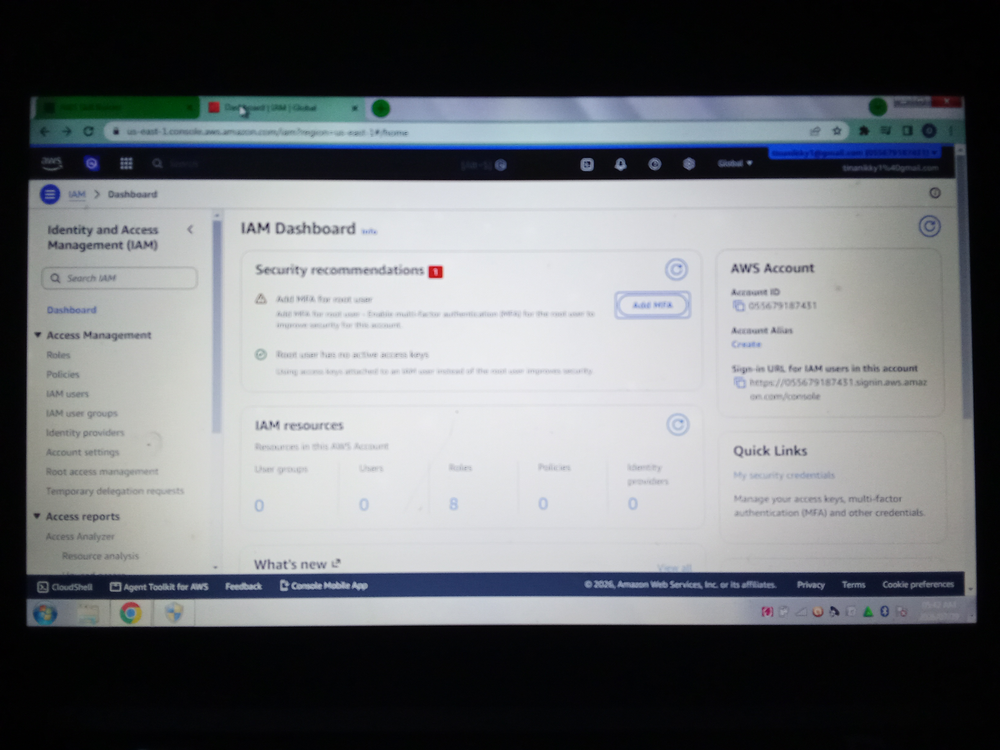
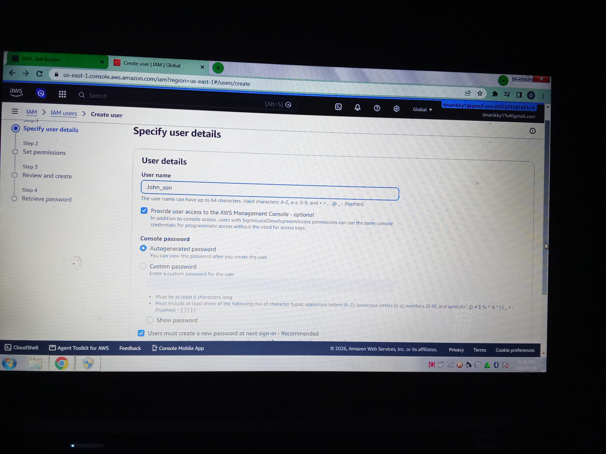
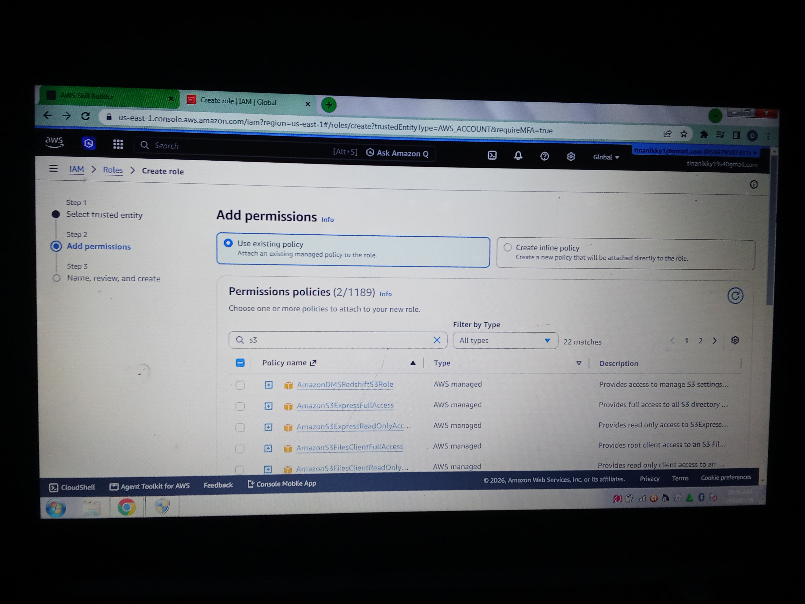

# Introduction to Security on AWS

Security is one of the most important parts of cloud computing. When you use AWS, keeping your data, applications, and resources safe is a shared responsibility between you and AWS.

AWS provides many security services and tools to help protect your cloud environment. One of the most important services is **AWS Identity and Access Management (IAM)**, which helps you control who can access your AWS resources and what they are allowed to do.

## Authentication

**Authentication** is the process of confirming the identity of a user or service. It answers the question:

**"Who are you?"**

Before anyone can use AWS resources, they must prove their identity by signing in with valid credentials such as a username and password, access keys, or multi-factor authentication (MFA).

### Authentication Use Cases

* Signing in to the AWS Management Console.
* A developer using access keys to connect to AWS through the AWS CLI.
* Enabling Multi-Factor Authentication (MFA) to add an extra layer of security.

## Authorization

**Authorization** is the process of deciding what an authenticated user is allowed to do. It answers the question:

**"What are you allowed to access or perform?"**

In AWS, authorization is controlled with **IAM policies**, which define permissions for users, groups, and roles.

### Authorization Use Cases

* Allowing a user to view Amazon S3 buckets but not delete files.
* Giving a developer permission to launch Amazon EC2 instances.
* Allowing an application to read data from an Amazon DynamoDB table but not modify it.

## AWS Shared Responsibility Model

AWS follows a **Shared Responsibility Model**, where security responsibilities are divided between AWS and the customer.

### AWS is Responsible for (Security **of** the Cloud)

AWS manages and protects the cloud infrastructure, including:

* Physical data centers
* Networking infrastructure
* Storage hardware
* Servers
* Virtualization layer

### Customers are Responsible for (Security **in** the Cloud)

Customers are responsible for securing what they build and store in AWS, including:

* Creating and managing IAM users and permissions
* Protecting passwords and access keys
* Encrypting sensitive data when needed
* Configuring security groups and network settings
* Updating applications and operating systems running on Amazon EC2

## Summary

Learning AWS security starts with understanding **authentication**, **authorization**, and the **Shared Responsibility Model**. Authentication verifies who a user is, while authorization determines what that user is allowed to do. By combining these concepts with AWS security services like IAM, you can build secure and reliable cloud environments.

# AWS IAM Hands-on Lab

## Screenshot 1: AWS IAM Dashboard

This screenshot shows the AWS Identity and Access Management (IAM) dashboard. IAM is the AWS service used to securely manage users, groups, roles, and permissions.

---

## Screenshot 2: Creating a New IAM User

This screenshot shows the creation of a new IAM user. IAM users represent individuals or applications that need secure access to AWS resources. Creating separate users instead of using the root account is a security best practice.

---

## Screenshot 3: Creating the Employees IAM Group

This screenshot shows the creation of an IAM group named **employees**. IAM groups make permission management easier by allowing multiple users to share the same set of permissions.

---

## Screenshot 4: IAM User Successfully Created

This screenshot confirms that the new IAM user was successfully created. The user can now be assigned permissions directly or through IAM groups to access AWS resources securely.

---

## Screenshot 5: Permission Policy Generated

This screenshot shows the permission policy generated for the IAM group. IAM policies define what actions users, groups, or roles are allowed or denied from performing on AWS resources.

---

## Screenshot 6: IAM Role Successfully Created

This screenshot confirms that the IAM role was successfully created. IAM roles provide temporary security credentials that can be assumed by trusted users, applications, or AWS services without using long-term access keys.
