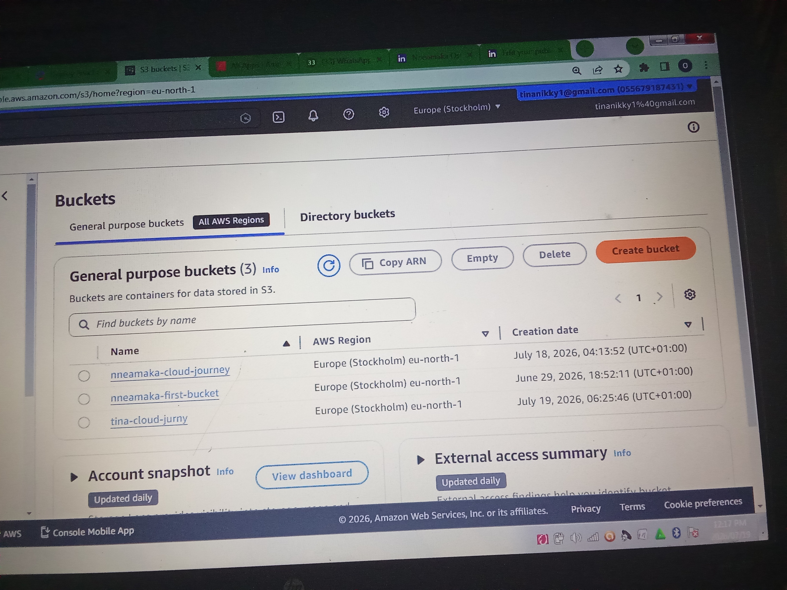
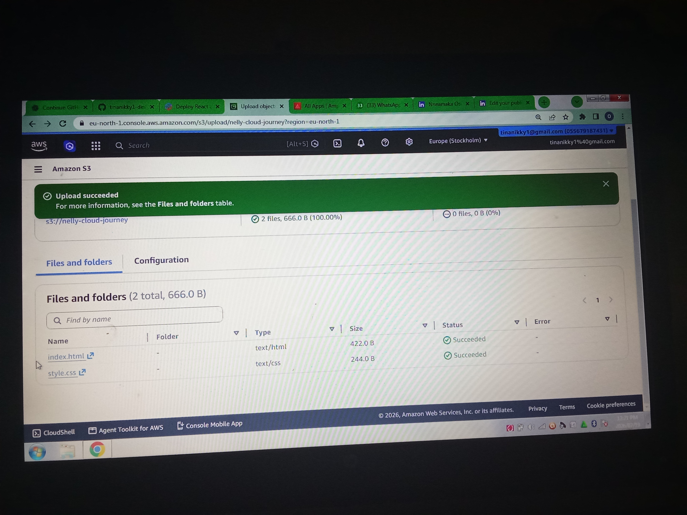
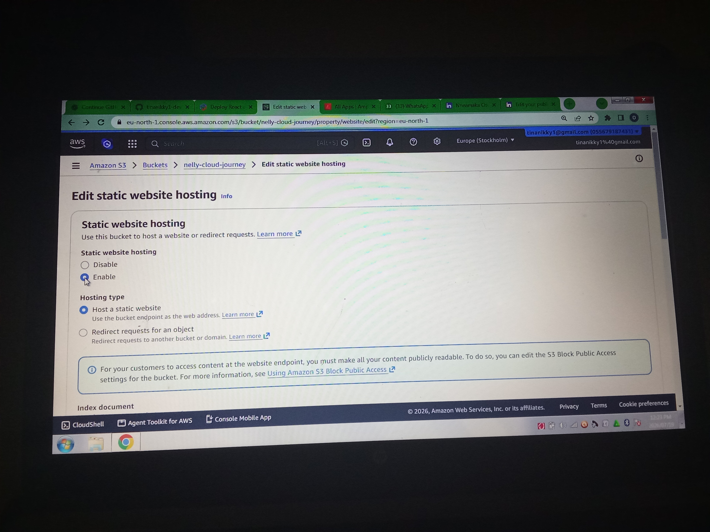
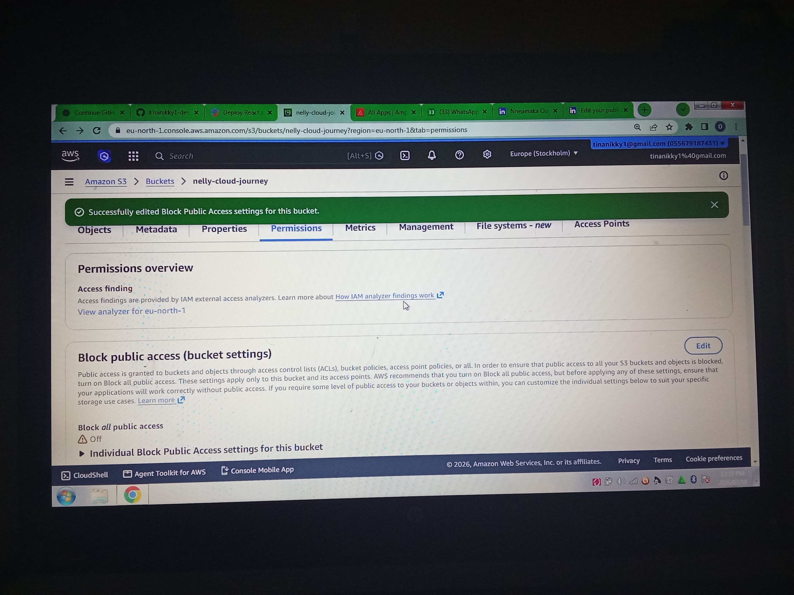
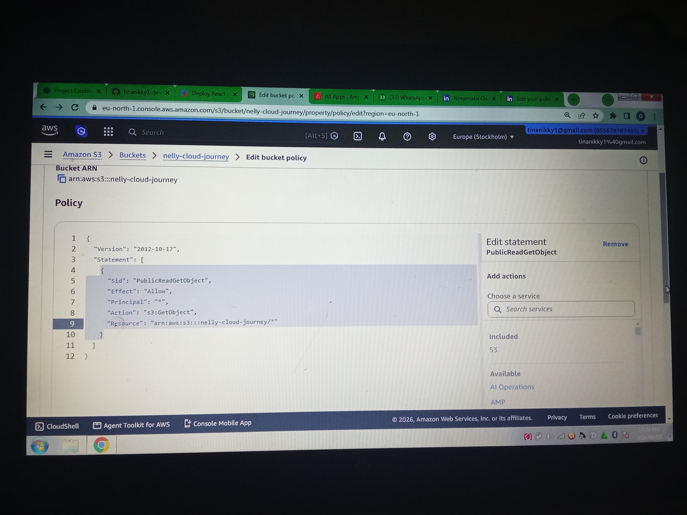
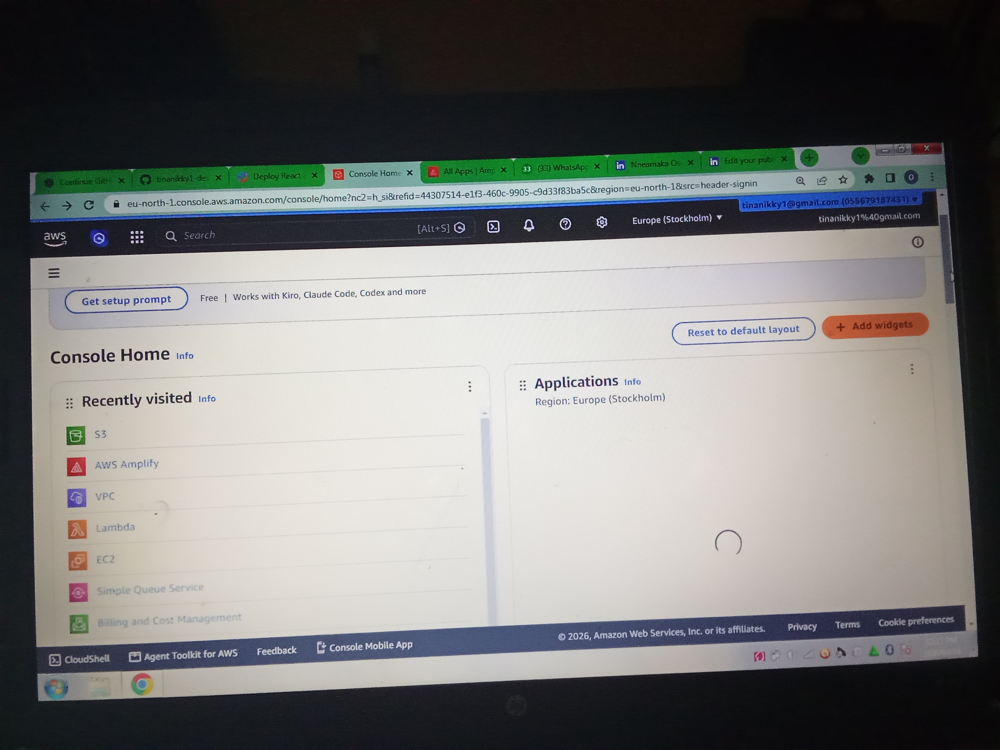
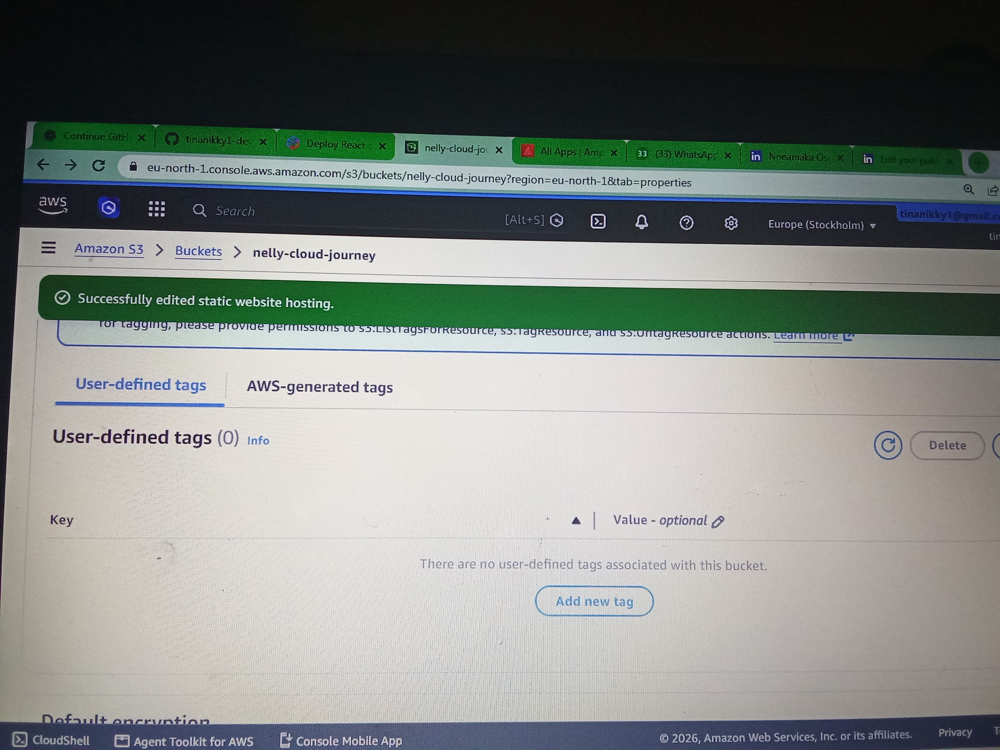
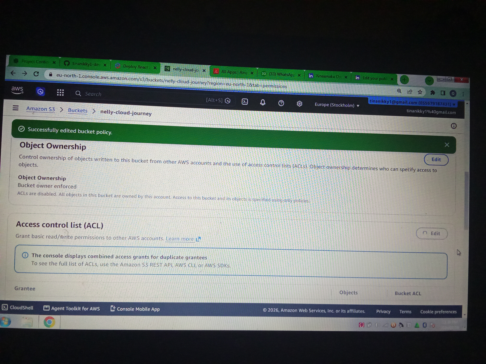
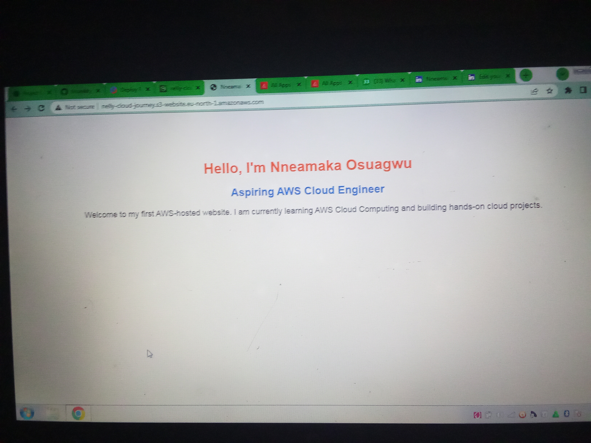

# Project 1: Hosting a Static Website on Amazon S3

## Project Overview

This project demonstrates how to host a static website using Amazon Simple Storage Service (Amazon S3).

The objective was to learn how AWS S3 can be used to host static websites by creating an S3 bucket, uploading website files, enabling static website hosting, configuring bucket permissions, and publishing a website to the internet.

This is my first hands-on AWS Cloud Engineering project.

---

## Project Objectives

- Create an Amazon S3 bucket
- Upload website files
- Enable Static Website Hosting
- Configure Bucket Policy
- Disable Block Public Access
- Publish the website
- Verify public accessibility

---

## AWS Services Used

- Amazon S3

---

## Project Architecture

```text
Local Computer
       │
       ▼
Upload HTML & CSS Files
       │
       ▼
Amazon S3 Bucket
       │
       ▼
Enable Static Website Hosting
       │
       ▼
Configure Bucket Policy
       │
       ▼
Public Website Endpoint
       │
       ▼
Live Website
```

---

## Files Used

- index.html
- style.css

---

# Implementation Steps

## Step 1: Create an S3 Bucket

Created an Amazon S3 bucket to host the static website.



---

## Step 2: Upload Website Files

Uploaded the website files into the S3 bucket.

- index.html
- style.css



---

## Step 3: Enable Static Website Hosting

Enabled static website hosting and configured:

- Host Static Website
- Index document: index.html



---

## Step 4: Disable Block Public Access

Disabled Block Public Access to allow the website to be publicly accessible.



---

## Step 5: Configure Bucket Policy

Configured the bucket policy to allow public read access to the website files.



---

## Step 6: Review the S3 Console

Verified that the bucket configuration was correctly applied.



---

## Step 7: Verify Static Website Hosting

Confirmed that static website hosting was successfully enabled.



---

## Step 8: Verify Public Access Policy

Confirmed that the public access policy was successfully configured.



---

## Step 9: Access the Live Website

Opened the website endpoint in the browser and confirmed that the website loaded successfully.



---

# Challenges Encountered

During this project, I encountered several challenges, including:

- Invalid Bucket Policy Resource
- Access permission errors
- Static website configuration issues
- Public access configuration

Troubleshooting these issues helped me better understand Amazon S3 permissions and website hosting.

---

# Lessons Learned

Through this project, I learned:

- How Amazon S3 stores website files
- How Static Website Hosting works
- How Bucket Policies control access
- Why Block Public Access affects website accessibility
- How website endpoints are generated
- Basic troubleshooting techniques for S3 static websites

---

# Final Result

The website was successfully deployed and made publicly accessible using Amazon S3 Static Website Hosting.

This project marks the beginning of my AWS Cloud Engineering portfolio.

---

# Skills Demonstrated

- Amazon S3
- Static Website Hosting
- Bucket Policies
- Cloud Storage
- AWS Console Navigation
- Troubleshooting
- GitHub Documentation
