# Project 2: Deploying a Web Server on Amazon EC2

## Project Overview

This project demonstrates how to launch an Amazon EC2 instance and deploy a basic web server using Apache on Amazon Linux 2023.

The objective was to understand how EC2 instances are created, configured, secured, and used to host web applications.

This project builds on my AWS Cloud learning by introducing compute services and Linux server administration.

---

## Project Objectives

- Launch an Amazon EC2 instance
- Create a new Key Pair
- Configure networking
- Configure Security Group rules
- Connect to the instance using EC2 Instance Connect
- Install Apache Web Server
- Create an HTML web page
- Verify the website from a browser
- Stop the instance to avoid unnecessary charges

---

## AWS Services Used

- Amazon EC2
- Security Groups
- EC2 Instance Connect

---

## Project Architecture

```text
Local Computer
       │
       ▼
Amazon EC2 Instance
       │
       ▼
Apache Web Server
       │
       ▼
HTML Web Page
       │
       ▼
Public IPv4 Address
       │
       ▼
Website in Browser
```

---

## Implementation Steps

### Step 1 – Opened the EC2 Console

Started by navigating to the Amazon EC2 service from the AWS Management Console.

### Screenshot

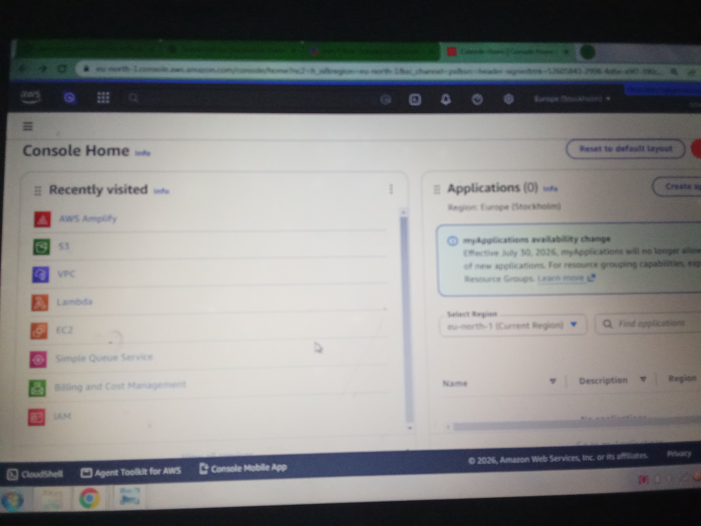

---

### Step 2 – Selected Amazon Machine Image (AMI)

Selected **Amazon Linux 2023** as the operating system.

### Screenshot

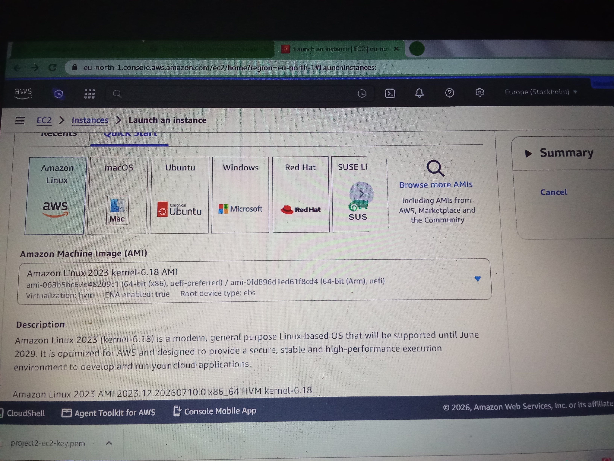

---

### Step 3 – Selected Instance Type

Selected **t3.micro**.

### Screenshot

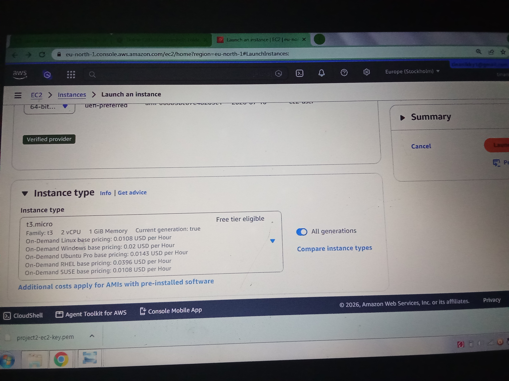

---

### Step 4 – Created a New Key Pair

Created a new EC2 key pair for secure access.

### Screenshot

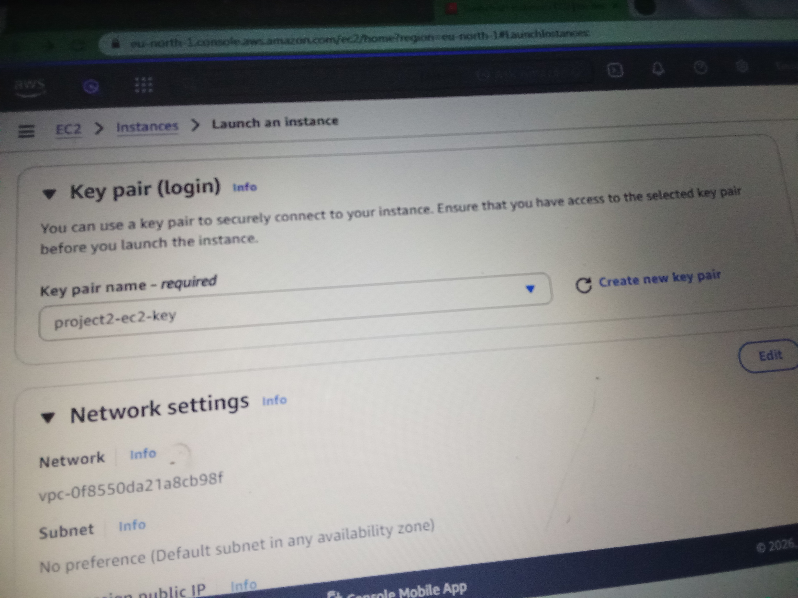

---

### Step 5 – Configured Storage

Accepted the default storage configuration.

### Screenshot

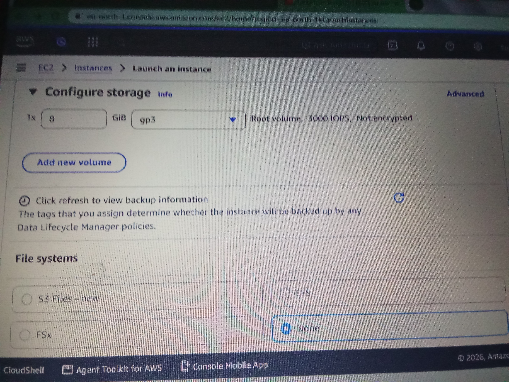

---

### Step 6 – Configured Network Settings

Configured the networking settings before launching the instance.

### Screenshot

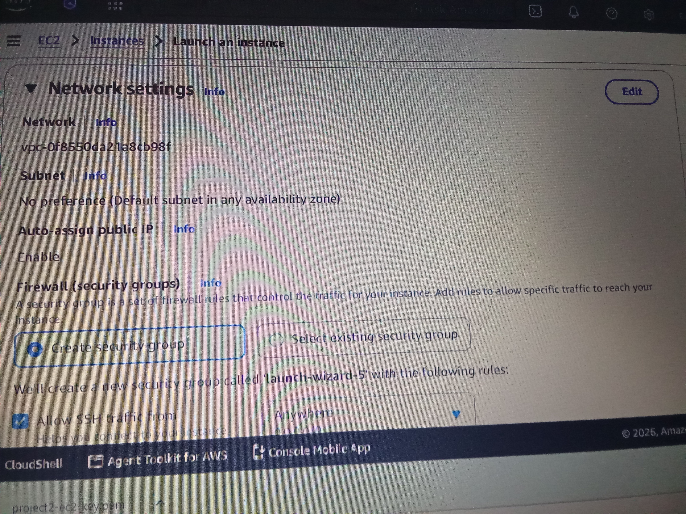

---

### Step 7 – Launched the EC2 Instance

Successfully launched the EC2 instance.

### Screenshot


---

### Step 8 – Verified Instance Status

Confirmed that both instance status checks passed.

### Screenshot

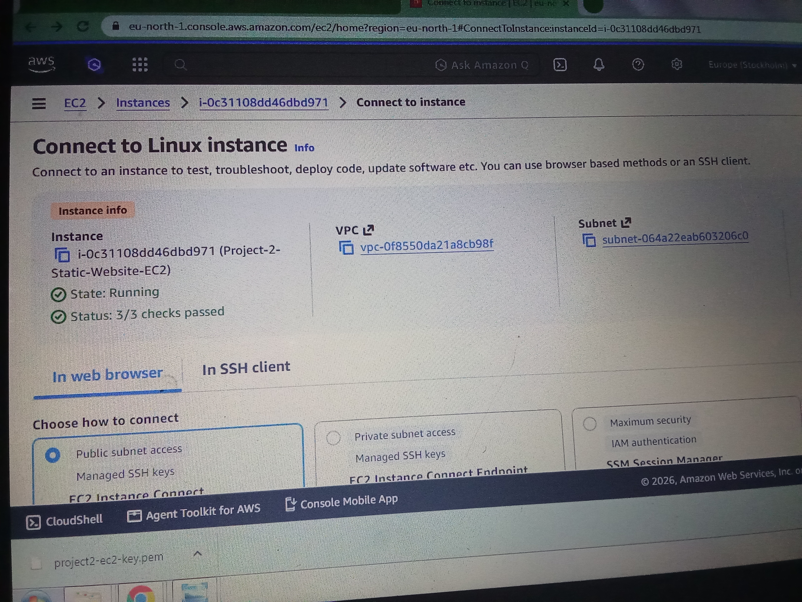

---

### Step 9 – Modified Security Group Rules

Added an inbound HTTP rule to allow web traffic.

### Screenshot

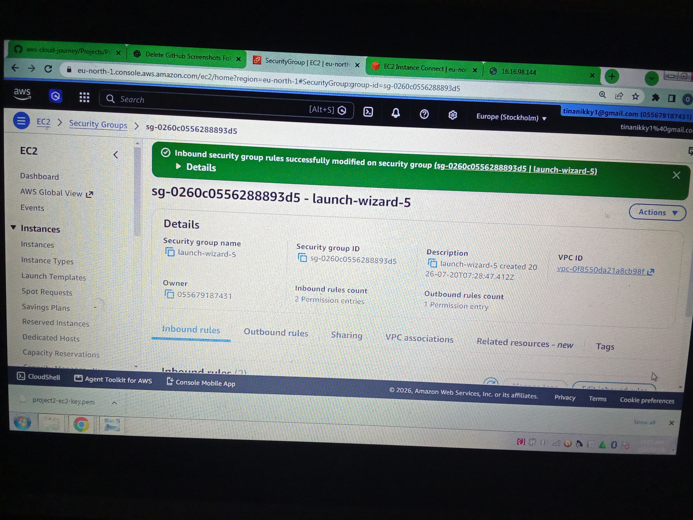

---

### Step 10 – Connected to the EC2 Instance

Connected using EC2 Instance Connect.

### Screenshot

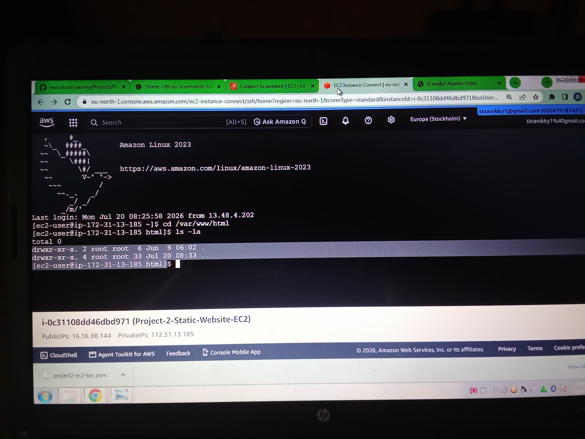

---

### Step 11 – Installed Apache

Installed Apache using:

```bash
sudo dnf install httpd -y
```

### Screenshot

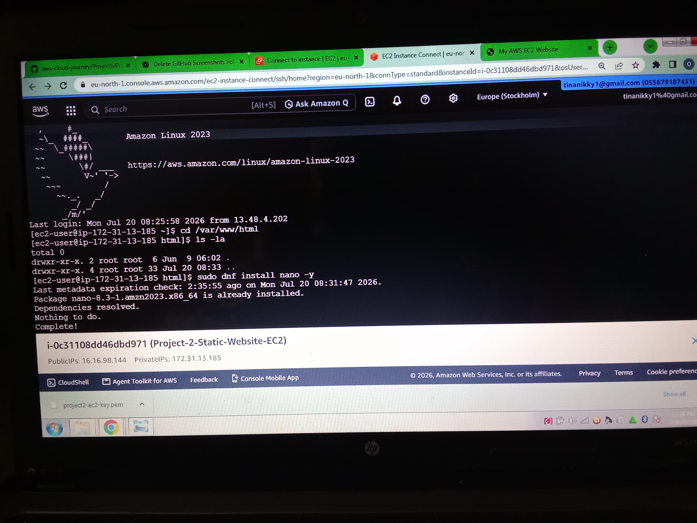

---

### Step 12 – Created the Website

Created an `index.html` file and linked a CSS stylesheet.

### Screenshots

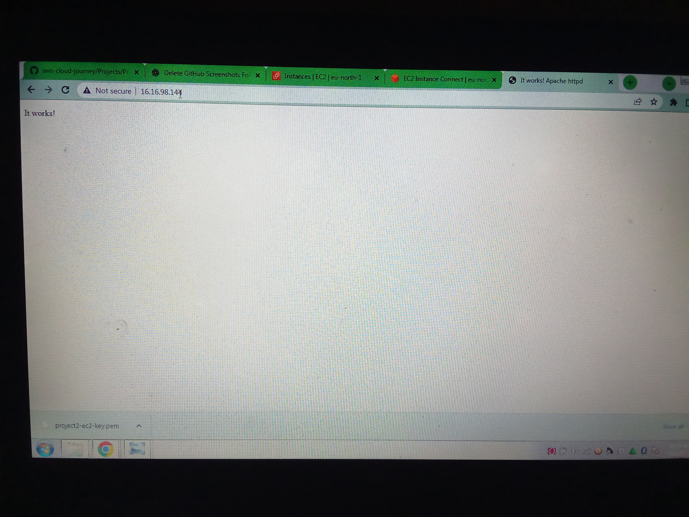


---

### Step 13 – Tested the Website

Opened the EC2 Public IPv4 address in the browser.

The website loaded successfully.

### Screenshot

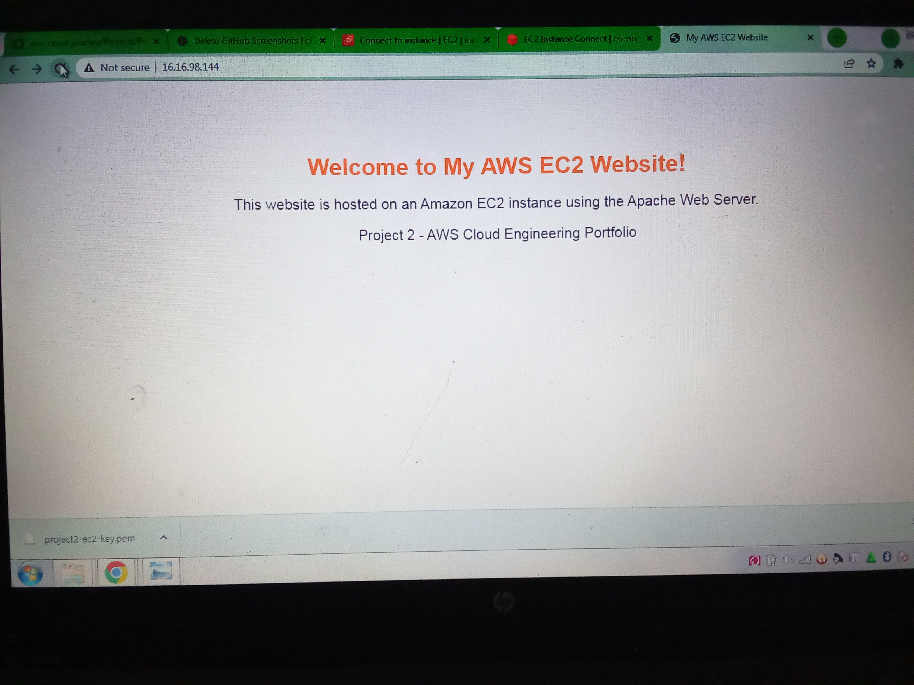

---

### Step 14 – Stopped the Instance

Stopped the EC2 instance after testing to avoid unnecessary AWS charges.

### Screenshot

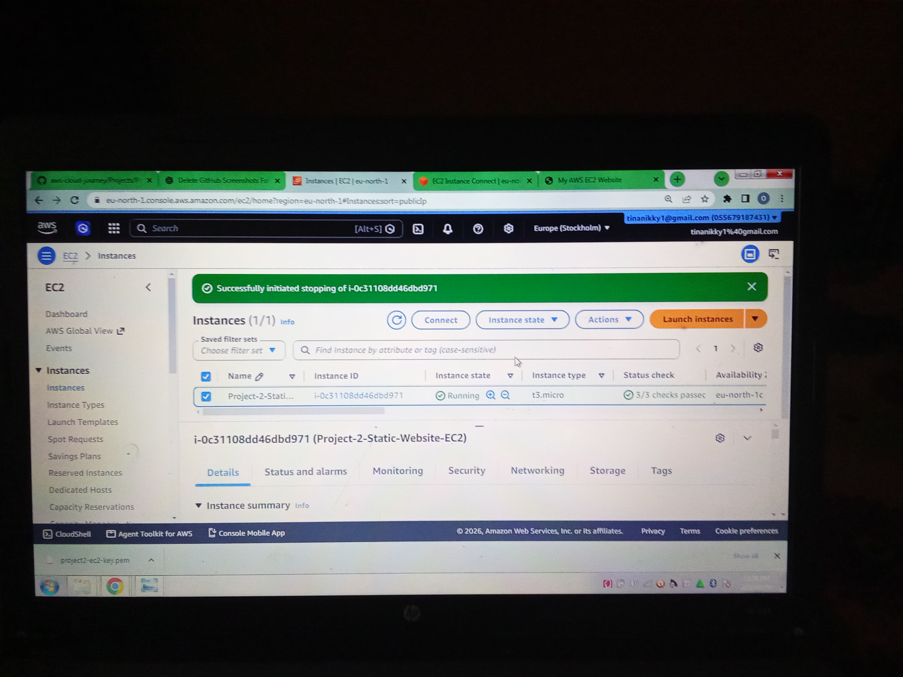

---

## Challenges Encountered

During this project I encountered several challenges, including:

- HTTP traffic blocked by Security Group rules
- Difficulty connecting to the terminal initially
- Apache installation and verification
- Browser showing "This site can't be reached"
- Learning Linux commands for the first time

Each issue improved my troubleshooting skills and understanding of AWS networking.

---

## Lessons Learned

Through this project I learned:

- How Amazon EC2 works
- How Security Groups protect EC2 instances
- How to connect using EC2 Instance Connect
- How to install Apache on Linux
- How to create and host a simple website
- The importance of allowing HTTP traffic
- Why instances should be stopped when not in use

---

## Final Result

Successfully deployed and hosted a web page on an Amazon EC2 instance using Apache Web Server.

---

## Skills Demonstrated

- Amazon EC2
- Linux Basics
- Apache Web Server
- EC2 Instance Connect
- Security Groups
- Networking
- Troubleshooting
- Cloud Infrastructure
